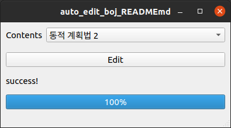
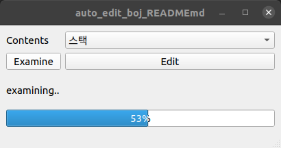
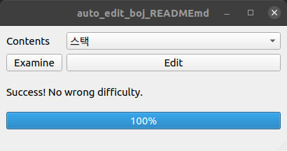
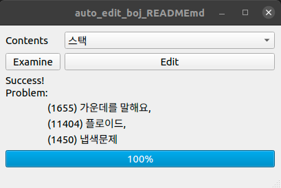

# auto-edit-boj-README.md

   

- [`boj/README.md`](https://github.com/kkg5/boj#%EB%B0%B1%EC%A4%80boj-) 파일에 버튼 한 번으로 내용을 추가해주는 프로그램

## 🚴 Function

- Edit 버튼

  - `README1.md` 파일에 선택한 목차에 해당하는 내용을 추가해 `README2.md`로 저장

- Examine 버튼 ( [solved.ac](https://solved.ac) 난이도가 변경되는 경우가 있음 )
  - `README1.md` 파일에서 `난이도`가 변경된 문제를 출력

## 👣 Step

- Edit 버튼

  - [`백준-단계별로 풀어보기`](https://www.acmicpc.net/step)에서 `목차` 크롤링 comboBox에 저장
  - comboBox에 저장된 목차 중 하나를 선택해 `Edit` 버튼 클릭
  - [`백준-단계별로 풀어보기`](https://www.acmicpc.net/step)에서 목차에 해당하는 `문제 번호`, `이름` 크롤링
  - [`solved.ac`](https://solved.ac)에서 문제들 `난이도` 크롤링
  - `README1.md` 파일에 내용 추가, `README2.md` 파일로 저장

- Examine 버튼
  - `Examine` 버튼 클릭
  - `README1.md` 파일에 있는 문제들의 `난이도` 파싱
  - [`solved.ac`](https://solved.ac)에서 문제들 `난이도` 크롤링
  - 둘을 비교해 `난이도`가 다른 문제들 출력

## 🔧 Should be fixed

- 예외 처리
- 코드 정리

## Chrome Driver

- `Selenium`을 사용하기 위해 크롬 버전에 맞는 크롬 드라이버가 필요함

- [다운로드 링크](https://sites.google.com/chromium.org/driver)

## Release Note

- 2022-06-17

  - new_main.py 추가 ( using [solvedac/api](https://solvedac.github.io/unofficial-documentation) )

- 2022-04-04

  - 비동기 처리

- 2022-03-16

  - Examine 버튼 추가

- 2022-02-21

  - progressBar 추가
  - 창 기본 위치 변경

- 2022-02-16
  - 기본 기능
